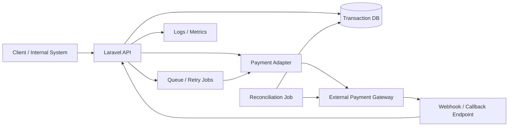

# Wayfinder Holidays – Laravel Practical Exercise

Ứng viên: **Vũ Minh Thành**  
Vị trí: **Senior Full-Stack Developer (Laravel)**


## Chạy project

Yêu cầu: PHP 8.2+, Composer, SQLite.

```bash
cp .env.example .env
composer install
php artisan key:generate
php artisan migrate --seed
php artisan test
php artisan serve
```

API chính:

```text
GET    /api/enquiries
POST   /api/enquiries
PATCH  /api/enquiries/{id}/status
```

---

# PART A – Đọc code, rủi ro và ưu tiên

## A.1. Các vấn đề tôi thấy trong code ban đầu

### 1. Public `store()` dùng `$request->all()` và model cho phép mass assign `status`

Người dùng public có thể gửi `status=booked` hoặc `status=closed` và tự quyết định trạng thái enquiry. Nếu giữ nguyên, workflow Sales mất tính toàn vẹn và dữ liệu có thể sai ngay từ lúc tạo.

### 2. Không có validation cho dữ liệu public

`tour_id`, `name`, `email`, `phone`, `preferred_month`, `message` đều được nhận trực tiếp. Nếu giữ nguyên, hệ thống có thể lưu dữ liệu không hợp lệ, email sai, chuỗi quá dài hoặc phát sinh lỗi database thay vì trả lỗi 4xx rõ ràng.

### 3. Không kiểm tra `tour_id` có tồn tại

Một `tour_id` không tồn tại có thể gây lỗi foreign key từ database. Nếu giữ nguyên, người dùng có thể nhận lỗi 500/DB exception thay vì lỗi validation dễ hiểu và không ổn định giữa các môi trường database.

### 4. `index()` gây N+1 query

Code gọi `TourEnquiry::all()` rồi trong vòng lặp truy cập `$enquiry->tour->name`. Nếu có N enquiry thì có thể sinh thêm N query lấy tour; dữ liệu càng lớn thì dashboard càng chậm và gây tải database không cần thiết.

### 5. `index()` tải toàn bộ enquiry vào memory

`TourEnquiry::all()` không có pagination hoặc giới hạn số bản ghi. Nếu bảng tăng lớn, request có thể chậm, dùng nhiều memory và trả payload quá lớn.

### 6. Endpoint được mô tả là staff dashboard nhưng route chưa có authentication/authorization

`GET /api/enquiries` có thể trả tên và email khách hàng cho bất kỳ client nào gọi được endpoint. Nếu đây thực sự là API nội bộ, giữ nguyên sẽ tạo rủi ro lộ PII.

### 7. Chưa có endpoint hoặc rule cho workflow trạng thái

`status` chỉ là một string với comment mô tả các giá trị. Nếu cập nhật trực tiếp ở nơi khác, có thể nhảy trạng thái tùy ý hoặc lưu giá trị ngoài `new/contacted/booked/closed`.

### 8. Rule chuyển trạng thái không được tập trung ở domain/model

Khi business rule nằm rải rác trong controller hoặc UI, các entry point khác có thể áp dụng khác nhau. Nếu giữ nguyên và module phát triển, việc thêm API/admin command có thể tạo behaviour không nhất quán.

### 9. Response của `store()` trả trực tiếp toàn bộ model

Hiện tại các field chưa nhiều nên chưa nghiêm trọng, nhưng cách này dễ vô tình public thêm field nội bộ nếu model/schema tăng về sau. Trong production tôi sẽ cân nhắc API Resource để cố định contract response.

### 10. Không có automated test bảo vệ behaviour quan trọng

Không có test cho validation, status mặc định, transition và listing. Nếu thay đổi code sau này, regression ở workflow enquiry có thể đi vào production mà không được phát hiện sớm.

### 11. Không có giới hạn/chính sách chống abuse được thể hiện rõ ở public form

Public endpoint có thể bị spam. Laravel API thường có middleware/rate-limiting ở tầng framework, nhưng từ đoạn code được cung cấp không đủ để xác nhận chính sách hiện tại đã phù hợp với lưu lượng thực tế hay chưa.

### 12. Chưa định nghĩa rõ format nghiệp vụ của `phone` và `preferred_month`

Schema chỉ dùng string, nhưng không có contract về định dạng. Nếu giữ nguyên, dữ liệu có thể không đồng nhất và khó tìm kiếm/report về sau.

## A.2. Ba việc tôi làm đầu tiên trong ngày đầu tiên

### Ưu tiên 1 – Bảo vệ public submission

Tôi sẽ thêm validation, whitelist field được phép nhận, kiểm tra `tour_id` tồn tại và ép `status = new` ở server.

**Lý do:** đây là entry point từ Internet và đang có khả năng ghi dữ liệu sai trực tiếp vào hệ thống. Đây là rủi ro về data integrity và ảnh hưởng tới mọi enquiry mới.

### Ưu tiên 2 – Xác nhận và bảo vệ các API nội bộ của Sales

Tôi sẽ kiểm tra cơ chế đăng nhập/role hiện có rồi đặt authentication + authorization phù hợp cho listing và status update.

**Lý do:** endpoint listing chứa PII khách hàng. Tôi không muốn tự chọn một cơ chế auth mới khi chưa biết hệ thống Wayfinder đang dùng session, Sanctum, SSO hay gateway.

### Ưu tiên 3 – Sửa truy vấn listing và bổ sung test cho các behaviour quan trọng

Tôi sẽ eager load `tour`, sau đó thêm test cho submission và status transition. Nếu số lượng enquiry lớn, tôi sẽ đưa pagination vào sau khi xác nhận API contract với frontend.

**Lý do:** N+1 là lỗi hiệu năng rõ ràng; test giúp các sửa đổi trong ngày đầu không tạo regression.

## A.3. Thông tin cần thêm trước khi chốt các quyết định ở A.2

### Với ưu tiên 1

Tôi cần xác nhận field nào thực sự bắt buộc trên form, format mong muốn của `phone`/`preferred_month`, giới hạn độ dài message và liệu có chống spam/CAPTCHA ở frontend hoặc gateway hay chưa. Tuy nhiên, việc không cho client chọn `status` và việc kiểm tra `tour_id` tồn tại là quyết định tôi có thể tự tin làm ngay.

### Với ưu tiên 2

Tôi cần biết hệ thống hiện đang dùng cơ chế auth nào, role/permission của Sales ra sao, API có nằm sau VPN/API gateway hay không và endpoint nào thực sự public. Tôi sẽ không tự thêm một auth stack mới chỉ dựa vào đoạn code rút gọn.

### Với ưu tiên 3

Eager loading có thể làm ngay vì không thay đổi response contract. Với pagination, tôi cần biết số lượng enquiry thực tế, UI đang consume JSON kiểu nào và có yêu cầu sort/filter/search gì không trước khi đổi shape response.

## A.4. Những việc tôi cố ý không làm trong ngày đó

**Không dựng Repository/Service layer chỉ để “đẹp kiến trúc”.** Module hiện nhỏ; thêm nhiều abstraction sẽ tăng thời gian và số file phải đọc mà chưa giải quyết rủi ro chính.

**Không đổi `status` sang database enum hoặc thiết kế state-machine package ngay.** Trước khi migrate dữ liệu production tôi cần audit trạng thái đang tồn tại và cách các phần khác của hệ thống sử dụng field này. Trong bài làm, constants + transition map là đủ rõ và dễ test.

**Không viết lại frontend/admin UI.** Yêu cầu hiện tại nằm ở API/data integrity; thay UI trong ngày đầu làm tăng phạm vi mà chưa có bằng chứng nó giải quyết vấn đề quan trọng hơn.

---

# PART B – Implementation và testing

## B.1. Public form

Tôi dùng `StoreEnquiryRequest` để whitelist và validate dữ liệu:

- `tour_id`: required, integer, phải tồn tại trong `tours`.
- `name`: required, string, max 255.
- `email`: required, email hợp lệ, max 255.
- `phone`: nullable, string, max 30.
- `preferred_month`: nullable, string, max 30.
- `message`: nullable, string, max 5000.
- `status` không nằm trong validated input và luôn bị server ghi đè thành `new`.

## B.2. Status update endpoint

Đã thêm:

```text
PATCH /api/enquiries/{enquiry}/status
```

Chỉ cho phép:

```text
new       -> contacted
contacted -> booked
contacted -> closed
booked    -> closed
```

Các transition khác trả HTTP 422 với lỗi rõ ràng và không thay đổi trạng thái đang lưu.

Tôi đặt transition map trong `TourEnquiry` để business rule không phụ thuộc riêng vào controller. Controller re-read bản ghi trong transaction và dùng `lockForUpdate()` trước khi kiểm tra transition để giảm rủi ro cập nhật cạnh tranh khi dùng database hỗ trợ row lock.

## B.3. Automated tests

Tôi viết test cho toàn bộ required behaviours, thay vì chỉ hai test tối thiểu.

Hai behaviour tôi ưu tiên bảo vệ nhất là:

1. **Public user không thể tự đặt status.** Đây là ranh giới tin cậy giữa Internet và workflow nội bộ.
2. **Invalid transition không được làm thay đổi dữ liệu.** Đây là rule nghiệp vụ cốt lõi; nếu sai có thể làm enquiry nhảy bước và ảnh hưởng Sales.

Các test còn lại bao phủ validation required/email, `tour_id` không tồn tại, valid transition và listing có `tour_name`.

## Các thay đổi bổ sung

- Eager load `tour` trong listing để loại bỏ N+1.
- Định nghĩa constants và transition map cho status.
- Thêm factories và seeder để test/demo nhanh.
- Không thêm authentication vào bài demo vì đề bài không cung cấp cơ chế auth hiện có. Trong production, `GET /enquiries` và `PATCH .../status` phải được đặt sau auth/authorization phù hợp với hệ thống Wayfinder.

## Assumptions

- `preferred_month` hiện được giữ là string có giới hạn độ dài vì đề không định nghĩa format chính thức. Nếu sản phẩm xác nhận chuẩn `YYYY-MM`, tôi sẽ đổi validation sang format cụ thể và cân nhắc kiểu dữ liệu phù hợp hơn.
- `phone` không ép theo định dạng quốc gia vì Wayfinder phục vụ thị trường quốc tế.
- Status mặc định luôn là `new` ở application layer và migration cũng có default `new` như một lớp bảo vệ bổ sung.
- Pagination chưa được thêm để giữ nguyên response shape của endpoint mẫu; trong production tôi sẽ thêm sau khi xác nhận contract với frontend.

---

# PART C – Production incident

**Tin nhắn gửi CEO:**

Chào anh/chị, hiện tại tôi chưa muốn kết luận form bị hỏng chỉ dựa trên phản ánh của Sales, vì enquiry có thể bị mất ở một trong nhiều bước: trình duyệt gửi form, API ghi database, notification/CRM hand-off hoặc quy trình Sales nhận và xử lý lead.

Tôi đang xử lý theo hướng giảm ảnh hưởng khách hàng trước, đồng thời tìm nguyên nhân. Đầu tiên tôi sẽ đối chiếu các enquiry trong ba ngày gần nhất giữa database, application logs và kênh mà Sales đang dùng để nhận lead. Nếu dữ liệu vẫn có trong database nhưng không đến được Sales, tôi sẽ xuất ngay danh sách các enquiry bị bỏ sót để Sales liên hệ thủ công trước, tránh khách hàng tiếp tục chờ. Nếu request không vào database, tôi sẽ kiểm tra lỗi ở public form/API, validation, deploy gần nhất và các lỗi 4xx/5xx trong cùng khoảng thời gian.

Tôi cũng sẽ kiểm tra xem sự cố ảnh hưởng toàn bộ khách hàng hay chỉ một nhóm tour/thời điểm/thiết bị, vì thông tin này giúp thu hẹp nguyên nhân nhanh hơn.

Tôi sẽ gửi cập nhật đầu tiên vào khoảng **10:00** với phạm vi ảnh hưởng, nguyên nhân khả nghi nhất và biện pháp tạm thời. Nếu xác định được fix nhỏ, ít rủi ro và có thể kiểm thử an toàn, tôi sẽ triển khai ngay sau đó; nếu nguyên nhân phức tạp hơn, tôi sẽ báo ETA mới thay vì cam kết một thời điểm không chắc chắn. Sau khi ổn định, tôi sẽ bổ sung monitoring/test để lỗi tương tự được phát hiện trước khi khách hàng phải gọi phản ánh.

---

# PART D – Background và self-review

## D.1. Một hệ thống tôi đã trực tiếp tham gia

### 1. Hệ thống làm gì?

Tôi từng tham gia phát triển backend cho một hệ thống xử lý giao dịch thanh toán và tích hợp nhiều đối tác/cổng thanh toán. Hệ thống nhận yêu cầu giao dịch, gửi sang đối tác, nhận callback/webhook và cập nhật trạng thái giao dịch cho các hệ thống nội bộ.

### 2. Phần tôi chịu trách nhiệm

Tôi phụ trách các API backend bằng PHP/Laravel, luồng tích hợp third-party, callback/webhook, xử lý trạng thái giao dịch, retry và một phần đối soát dữ liệu.

### 3. Quyết định kỹ thuật quan trọng nhất

Tôi tách trạng thái giao dịch trong hệ thống khỏi response tức thời của đối tác và xử lý callback theo hướng idempotent. Với các tác vụ có thể retry hoặc đến trễ, tôi dùng queue/job và kiểm tra trạng thái trước khi ghi để hạn chế xử lý trùng.

### 4. Vấn đề khó nhất khi chạy production

Khó nhất là các trường hợp timeout nhưng đối tác thực tế đã nhận giao dịch, callback đến chậm hoặc gửi lặp. Nếu chỉ dựa vào HTTP response ban đầu có thể dẫn tới retry nhầm, ghi trạng thái sai hoặc tạo giao dịch trùng.

### 5. Nếu làm lại, tôi sẽ thay đổi gì?

Tôi sẽ đầu tư sớm hơn cho observability và reconciliation: correlation ID xuyên suốt request, structured log, metric theo trạng thái và job đối soát chủ động. Việc này giúp rút ngắn thời gian điều tra khi xảy ra lệch trạng thái giữa các hệ thống.

### Architecture diagram



## D.2. Tự review bài làm

Phần tôi tự tin nhất là **validation + status workflow + automated tests**, vì các rule được thể hiện rõ trong code và có test bảo vệ các acceptance criteria chính.

Phần tôi ít tự tin nhất là **giả định về authentication và format một số field**, vì đề bài cố ý chỉ cung cấp một slice code và không cho biết auth stack hoặc contract frontend đầy đủ.

Nếu có thêm hai giờ, tôi sẽ dùng thời gian để: kiểm tra API contract với một frontend giả lập, thêm authorization test sau khi biết auth scheme, bổ sung pagination/filter cho listing và chạy static analysis/code style trong CI.

## D.3. Năm câu hỏi tôi muốn được trả lời trước khi quyết định gia nhập Wayfinder

1. Trong 6–12 tháng tới, ba vấn đề kỹ thuật hoặc sản phẩm quan trọng nhất mà Senior Developer sẽ trực tiếp chịu trách nhiệm là gì?
2. Hiện team engineering có bao nhiêu người, cách review code/deploy/on-call đang vận hành thế nào và kế hoạch tuyển thêm người ra sao?
3. Hệ thống hiện tại đang ở mức test coverage, monitoring, CI/CD và technical debt như thế nào; công ty dành bao nhiêu thời gian cho việc cải thiện chúng?
4. Senior Full-Stack Developer được quyền quyết định kiến trúc/kỹ thuật đến mức nào, và các trade-off giữa tốc độ delivery với chất lượng được thống nhất với business ra sao?
5. Sau 3 và 6 tháng, Wayfinder sẽ dùng tiêu chí nào để đánh giá một người ở vị trí này đang làm tốt?

---